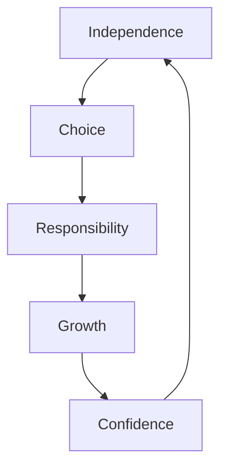

# Agency

Agency is the capacity of individuals to act independently, make their own free choices, and exert control over their learning and development. It's a fundamental aspect of human autonomy and self-directed growth.

## Core Components of Agency

### 1. Self-Efficacy
> [!note] Belief in Capability
> The confidence in one's ability to achieve goals and overcome challenges.
- Setting realistic goals
- Building on past successes
- Developing competence
- Managing self-doubt

### 2. Autonomy

### 3. Self-Regulation
> [!important] Managing Learning
> The ability to monitor and adjust one's own learning process.
- Planning strategies
- Monitoring progress
- Evaluating outcomes
- Adapting approaches

## Types of Agency

| Type | Description | Examples |
|------|-------------|----------|
| Personal | Individual control over actions | Setting personal goals |
| Proxy | Acting through others | Seeking mentorship |
| Collective | Group-based action | Collaborative learning |

## Building Agency

### Key Strategies
1. **Develop Decision-Making Skills**
   - [ ] Identify choices
   - [ ] Evaluate options
   - [ ] Make informed decisions
   - [ ] Reflect on outcomes

2. **Foster Independence**
   - [ ] Take initiative
   - [ ] Accept responsibility
   - [ ] Learn from mistakes
   - [ ] Seek feedback

3. **Practice Self-Advocacy**
   - [ ] Express needs
   - [ ] Set boundaries
   - [ ] Ask for help
   - [ ] Stand up for beliefs

## Related Concepts
- [[Motivation]] - Internal drive
- [[Resilience]] - Bouncing back
- [[Growth Mindset]] - Belief in development
- [[Self-Determination]] - Autonomous action

## Common Barriers

> [!warning] Challenges to Agency
> - External control
> - Limited choices
> - Fear of failure
> - Learned helplessness
> - Excessive structure

## Developing Agency

### Personal Development
1. Set meaningful goals
2. Make conscious choices
3. Take responsibility
4. Learn continuously

> [!tip] Building Agency
> - Start with small decisions
> - Gradually increase responsibility
> - Celebrate autonomous choices
> - Learn from outcomes

## Impact on Learning

### Benefits of Strong Agency
- Increased motivation
- Better engagement
- Deeper learning
- Greater persistence
- Enhanced creativity

### Supporting Agency in Learning
1. **Provide Choice**
   - Learning paths
   - Project topics
   - Assessment methods

2. **Encourage Reflection**
   - Self-assessment
   - Goal setting
   - Progress monitoring

3. **Foster Independence**
   - Problem-solving
   - Decision-making
   - Resource management

## Quotes on Agency

> "The only person you are destined to become is the person you decide to be."
> — Ralph Waldo Emerson

> "Freedom is not worth having if it does not include the freedom to make mistakes."
> — Mahatma Gandhi

## Questions for Growth

1. How do you exercise agency in your learning?
2. What barriers limit your sense of agency?
3. How can you increase your autonomous action?
4. When do you feel most in control of your learning?

## Further Exploration
- The role of agency in motivation
- Cultural influences on agency
- Agency in different learning contexts
- Building collective agency

## Practical Applications

### In Learning
- Choosing learning paths
- Setting personal goals
- Managing time
- Seeking resources

### In Life
- Making decisions
- Taking initiative
- Solving problems
- Building independence

---

## Additional Resources
1. Research on learner agency
2. Case studies of autonomous learning
3. Tools for developing agency
4. Community support strategies

#agency #autonomy #learning #self-determination #growth
EOL