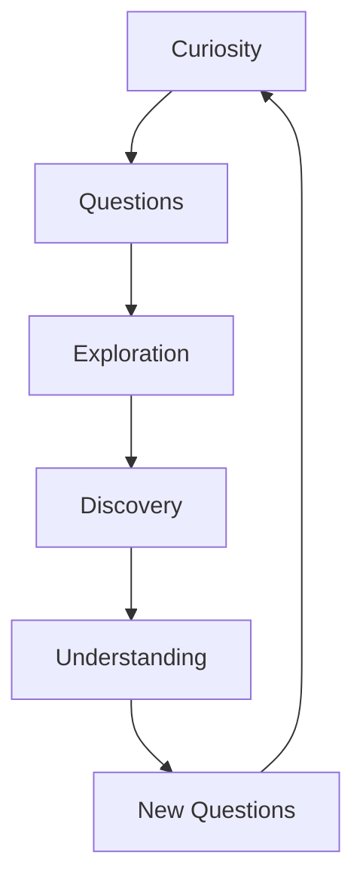

# Curiosity

Curiosity is the intrinsic desire to learn, explore, and understand. It's a fundamental driver of human development and learning, acting as an internal motivation for discovery and growth.

## Types of Curiosity

### 1. Epistemic Curiosity
> [!note] Knowledge-Seeking
> The desire to acquire new knowledge and intellectual stimulation.
- Driven by gaps in understanding
- Leads to deep learning
- Connected to [[Knowledge]] acquisition

### 2. Perceptual Curiosity
> [!note] Sensory-Driven
> Attention and reaction to novel sensory stimuli.
- Visual exploration
- Sound investigation
- Tactile examination

### 3. Specific vs. Diversive Curiosity
| Type | Description | Example |
|------|-------------|---------|
| Specific | Focused desire to solve particular problems | Solving a puzzle |
| Diversive | General seeking of novelty | Browsing social media |

## The Science of Curiosity

### Neurological Basis
- Dopamine release during exploration
- Activation of reward centers
- Enhanced memory formation

### Psychological Benefits
1. **Improved Learning**
   - Better retention
   - Deeper understanding
   - Enhanced engagement

2. **Personal Growth**
   - Increased creativity
   - Better problem-solving
   - Greater adaptability

## Cultivating Curiosity

> [!tip] Fostering Curiosity
> - Ask open-ended questions
> - Embrace uncertainty
> - Follow your interests
> - Challenge assumptions

### Practical Steps
- [ ] Ask "Why?" more often
- [ ] Explore new topics regularly
- [ ] Document questions and insights
- [ ] Share discoveries with others

## Related Concepts
- [[Motivation]] - Internal drive for exploration
- [[Agency]] - Taking control of learning
- [[Knowledge]] - The result of curious inquiry
- [[Learning]] - The process of satisfying curiosity

## Impact on Learning

## Barriers to Curiosity
1. Fear of failure
2. Fixed mindset
3. Time constraints
4. Social pressure

> [!warning] Common Pitfalls
> - Rushing to conclusions
> - Avoiding uncertainty
> - Fear of asking "stupid" questions

## Quotes About Curiosity

> "I have no special talents. I am only passionately curious."
> — Albert Einstein

> "The important thing is not to stop questioning. Curiosity has its own reason for existing."
> — Albert Einstein

## Further Exploration
- The role of curiosity in innovation
- Cultural differences in curiosity expression
- Relationship between curiosity and creativity
- Methods for maintaining lifelong curiosity

#curiosity #learning #motivation #growth #discovery
EOL