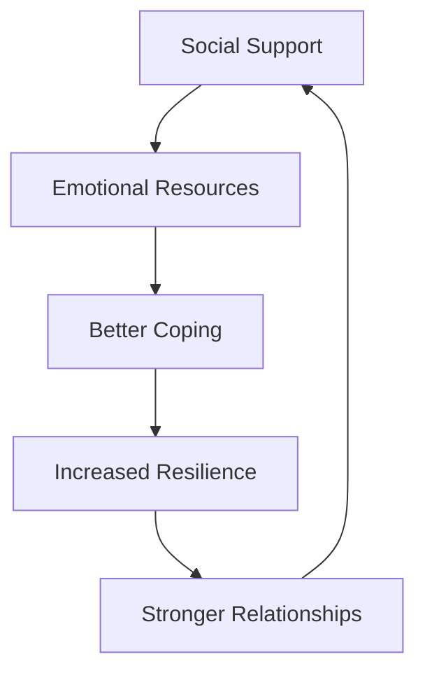

# Resilience

Resilience is the capacity to recover, adapt, and thrive in the face of adversity, challenges, or change. It's not just about "bouncing back" but about growing stronger through difficulties.

## Components of Resilience

### 1. Psychological Resilience
> [!note] Mental Strength
> The ability to maintain mental well-being and adapt to emotional challenges.
- Emotional regulation
- Positive self-talk
- Growth mindset
- Adaptive thinking patterns

### 2. Academic Resilience
> [!important] Learning Through Challenges
> Persistence in educational pursuits despite setbacks.
- Embracing mistakes as learning opportunities
- Maintaining focus despite difficulties
- Converting failures into growth

### 3. Social Resilience

## Building Resilience

### Key Strategies
1. **Develop Problem-Solving Skills**
   - Break down challenges
   - Create action plans
   - Learn from outcomes

2. **Foster Connections**
   - Build support networks
   - Share experiences
   - Ask for help when needed

3. **Practice Self-Care**
   - [ ] Regular exercise
   - [ ] Adequate sleep
   - [ ] Healthy nutrition
   - [ ] Mindfulness practices

## The 4 Pillars of Resilience

| Pillar | Description | Development Strategy |
|--------|-------------|---------------------|
| Awareness | Understanding challenges | Self-reflection and mindfulness |
| Thinking | Flexible thought patterns | Cognitive reframing |
| Capacity | Physical and mental strength | Regular practice and rest |
| Connection | Social support systems | Building relationships |

## Related Concepts
- [[Growth Mindset]] - Belief in ability to develop
- [[Motivation]] - Drive to persist
- [[Agency]] - Taking control of outcomes
- [[Learning]] - Continuous improvement

## Common Misconceptions

> [!warning] Resilience Myths
> - Resilient people don't experience stress
> - Resilience means handling everything alone
> - You're either resilient or you're not
> - Showing emotion means lack of resilience

## Developing Resilience

### Daily Practices
1. Reflect on challenges
2. Celebrate small wins
3. Practice gratitude
4. Set realistic goals

> [!tip] Building Resilience
> - Start small
> - Be consistent
> - Focus on progress
> - Learn from setbacks

## Quotes on Resilience

> "The oak fought the wind and was broken, the willow bent when it must and survived."
> — Robert Jordan

> "Success is not final, failure is not fatal: it is the courage to continue that counts."
> — Winston Churchill

## Applications in Learning

### Academic Context
- Handling feedback constructively
- Persisting through difficult concepts
- Adapting study strategies
- Maintaining motivation

### Life Skills
- Problem-solving
- Emotional regulation
- Adaptability
- Growth through challenge

## Further Exploration
- Neuroplasticity and resilience
- Cultural perspectives on resilience
- Resilience in different contexts
- Building collective resilience

## Questions for Reflection
- How do you typically respond to setbacks?
- What strategies help you bounce back?
- Who supports you during challenges?
- How has resilience helped you grow?

---

## Related Resources
1. Research on psychological resilience
2. Case studies of resilient learners
3. Practical resilience-building exercises
4. Community support strategies

#resilience #growth #mindset #psychology #learning
EOL